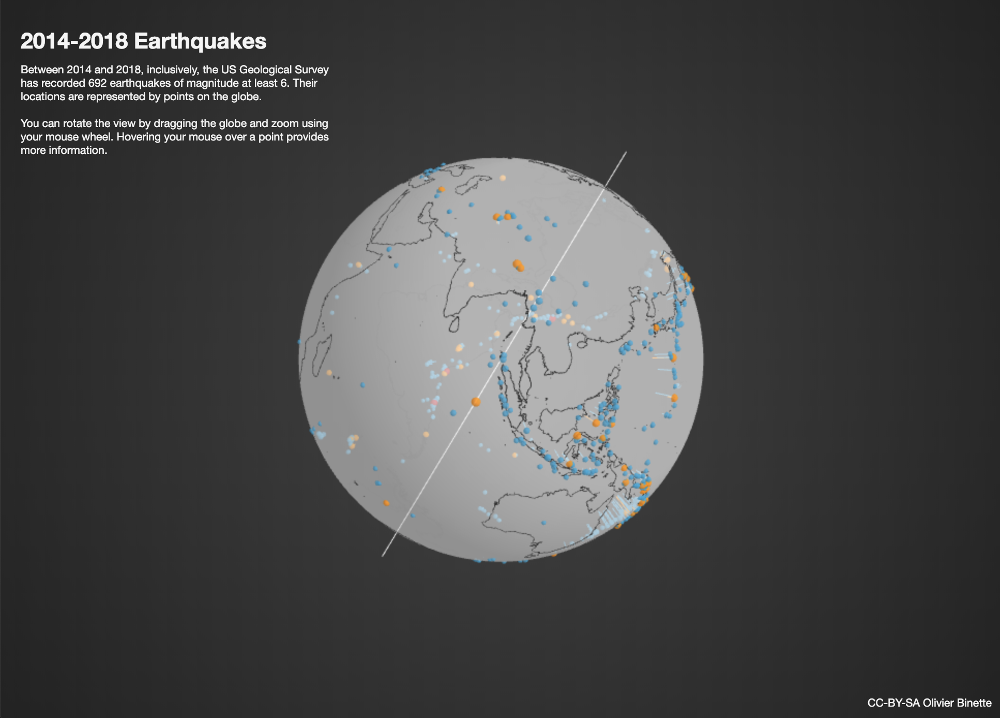

<!-- wp:paragraph -->

I wanted to make a web tool for high-dimensional data exploration through spherical multidimensional scaling (S-MDS). The basic idea of S-MDS is to map a possibly high-dimensional dataset on the sphere while approximately preserving a matrix of pairwise distances (or divergences). An interactive visualization tool could help explore the mapped dataset and translate observations back to the original data domain. I'm not quite finished, but I made a frontend prototype. The next step would be to implement the multidimensional scaling algorithm in Javascript. I may get to this if I find the time.

<!-- /wp:paragraph -->

<!-- wp:paragraph -->

In the current <a href="http://olivierbinette.github.io/earthquakes">applet</a>, you can visualize the positions and depths of earthquakes of magnitude greater than 6 from January 1st 2014 up to January 1st 2019. Data is from the US Geological Survey (usgs.gov). Code is <a href="https://github.com/OlivierBinette/earthquakes">on GitHub</a>.

<!-- /wp:paragraph -->

