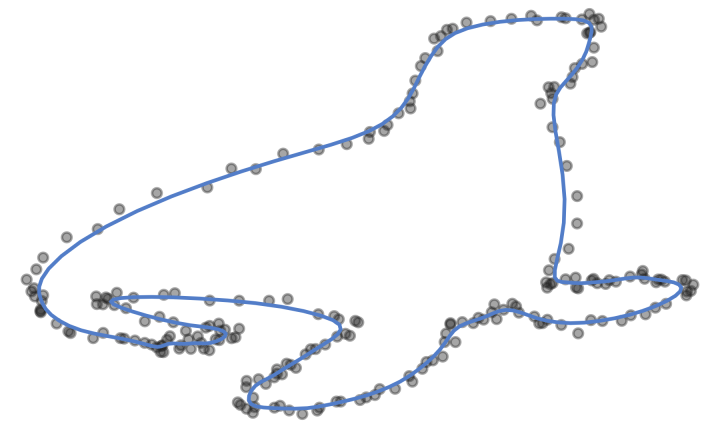

[Code on Github.](https://github.com/OlivierBinette/Splinit)

There are a number of "open" problems in curve/surface reconstruction, such as reconstructing self-intersections, quantifying uncertainty and topological guarantees in the presence of noise.

In the computer graphics/CAGD literature, it is often assumed that the set of observed points forms a dense exact sample from the object of interest. Topological properties of reconstruction algorithms are then analysed from this deterministic point of view. However, this framework is difficult to adapt to the presence of noise and can at best provide a sampling theory for $\varepsilon$-neighbourhoods.

The "implicit" approaches to reconstruction supposes the existence of a smooth function $f$ modelling the object of interest as the level set $f^{-1}(0)$. If the observed points also carry gradient information, then there is hope that we may approximate $f$ in a neighbourhood of the curve. In fact, as I show in this post (a particular case of the Nash-Tognoli theorem), approximating both $f$ and its gradient $\nabla f$ in the sup norm entails the ability to approximate the surface $f^{-1}(0)$ in the Hausdorff + diffeomorphic topology of compact manifold space. Somewhat similar ideas have been exploited in Kolluri (2008) to obtain topological guarantees for a moving least squares implicit method of reconstruction.

There has also been a few statistical approches to the problem (e.g. Gu et al. (2014)). Those I am aware of, while pertinent and original, do not bring considerably more profound insight. Likelihood based inference currently seems to bring more computational and theorical difficulties than solutions.

**Ideas and brainstorming:**

- *How can we assess whether a reconstruction has been successful?* Assume we are trying to reconstruct a smooth manifold and let $\gamma$ be the reconstructed curve (or hypersurface). Let $\nu: \gamma \rightarrow \mathbb{R}^k$ be the normal function (i.e. $\nu(x)$ is a unit normal to $\gamma$ at the point $x \in \gamma$). We may be given a credible region for $\gamma$ as the set $C = \{ x + \varepsilon f(x) \nu(x) \mid \varepsilon \in [-1,1] \}$ where $f$ quantifies pointwise normal uncertainty. Points in $C$ that are closest to more than one point on $\gamma$ may be considered problematic: their existence entails that some plausible deformations of $\gamma$ (as defined by $f$) are not manifolds.

- *How can we reconstruct self-intersections?* I'd like to try this: $\arg \min_\gamma \sum_{i} \text{dist}(y_i, \gamma) + \lambda \int \|\gamma''\|$ where $\gamma$ is parametrized by arc length and constrained to a suitable space of curves, and where $\lambda$ is a regularization parameter. This is sort of an orthogonal regression with total curvature penalty. The real issue here is figuring out if this can be solved reasonably efficiently.

- *Fused ridge implicit reconstruction.* Solve $\arg \min_f\sum_{i} \text{dist}\left(y_i, f^{-1}(0)\right) + \lambda \int \|\nabla f\|^2$. Here we may restrict $f$ to be a polynomial of known degree. I don't know if this would work well. Maybe $\text{dist}(y_i, f^{-1}(0))$ can be more easily approximated here using the gradient of $f$.
