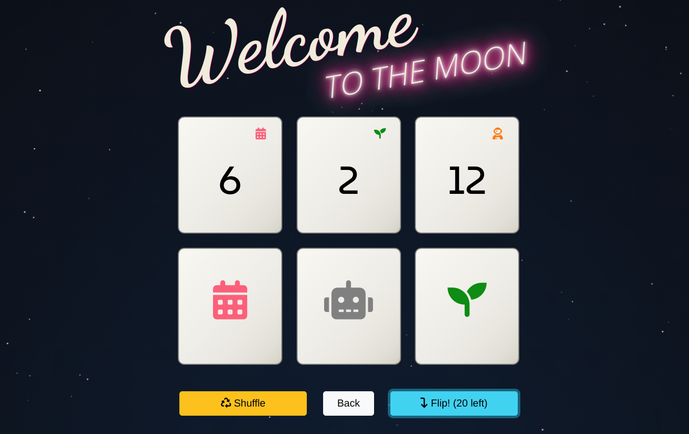

```{r setup, include=FALSE}
knitr::opts_chunk$set(echo = FALSE)
```

If you know me, you know that I love playing board games. I like the puzzle, the challenge, and -- most of all -- the stories that unfold as a game goes on.

I recently discovered [Welcome to the Moon](https://boardgamegeek.com/boardgame/339789/welcome-moon). It's a "flip and write" board game which is quite easy to learn and play. It's also a lot of fun with only two players, which is a good fit for me and my partner.

<center>
  <a href="https://boardgamegeek.com/boardgame/339789/welcome-moon"></a>
</center>

I'm a bit lazy about the card flipping aspect of this game though, which is the only thing keep us from playing the game on the couch (or remotely via screen sharing). So I wrote a simple web app to do the flipping for us: [**olivierbinette.github.io/welcome-to-the-moon-card-flipper/**](https://olivierbinette.github.io/welcome-to-the-moon-card-flipper/)

<a href="https://olivierbinette.github.io/welcome-to-the-moon-card-flipper/"></a>

I hope you enjoy if you're a fan of the game!

## Remote Play

The rulebook for the game and its 8 adventure sheets are available on the [publisher's website](https://bluecocker.com/en/landing-page/#post-987). You can play the game remotely using the adventure sheets and my website.
