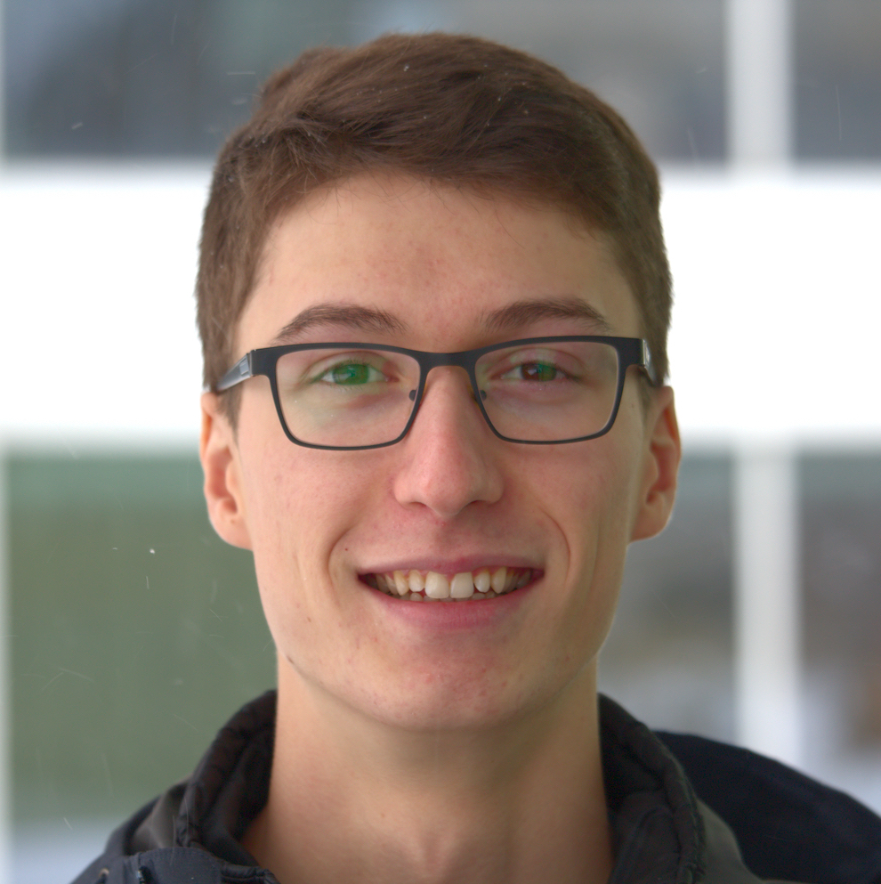

<!---->
I am Olivier, a PhD student in the Statistical Science department at Duke University. I hold a Mathematics B.Sc. and a Statistics M.Sc. from Université du Québec à Montréal. My research is currently supported by Professor Rebecca C. Steorts at Duke, by an Alexander-Graham-Bell Canada Graduate Scholarship, and by a doctoral award from the Fonds de Recherche du Québec - Nature et Technologies. I was awarded the Canada Governor General's Academic Medal in 2020 for outstanding academic achievements during my M.Sc.

I have broad ranging interests in statistics. My M.Sc. research focused on theoretical properties of Bayesian nonparametric procedures. Recently, I have been working on more applied problems. I am particularly interested in issues surrounding inference with "big" administrative data, as well as using such data to better represent hidden populations in official statistics. This research involves privacy considerations, entity resolution for data integration and multiple systems estimation to account for undercoverage. 

In my free time, I like to get involved with other students on campus. I work with the Duke Applied Machine Learning Group and with the Data+ program as a project manager, I am a mentor for the Twoples directed reading program, and I am involved with the Graduate and Professional Student Government (as a representative and with the Community Pantry). I am very grateful for our international academic community and I try to give back as I can.

### What's on here?

This website lists some of what I do. Check out my [research](./research.html), [teaching](./teaching.html), and [software](./software.html).

### Links

Some things I find interesting:

- ["23 things I didn't learn in college or grad school."](https://twitter.com/dsivakumar/timelines/1328255107599802368) A Twitter collection by D. Sivakumar.
- [Teaching Tech Together](https://teachtogether.tech/en/index.html) by Greg Wilson

- [Teaching Tech Together](https://teachtogether.tech/en/index.html) by Greg Wilson.
