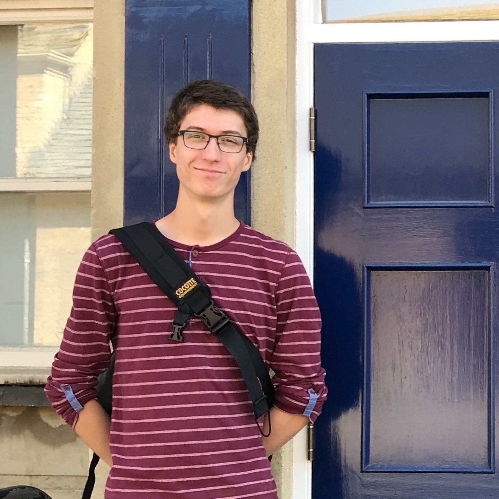

  <link rel="stylesheet" href="custom.css">


<center>

</center>

<center>
```{r, echo=FALSE}
library(distilltools)
icon_link(icon="fa fa-github", text="Github", url="https://github.com/olivierbinette")
htmltools::span(style="padding:10px")
icon_link(icon="fa fa-linkedin", text="LinkedIn", url="https://www.linkedin.com/in/olivier-binette/")
htmltools::span(style="padding:10px")
icon_link(icon="fa fa-envelope", text="Email", url="mailto:olivier.binette@duke.edu")


```

</center>
 
# 👋 Welcome!

This website lists some of what I do. Check out my [ research](./research.html), [teaching](./teaching.html), and [software](./software.html).

### Hire me

I consult with small and medium-sized businesses on the topics of record linkage and deduplication, survey methods, data analysis, R/Python package development, and statistical learning. Learn more on my [**consulting**](consulting.html) page.

### About me

I am a PhD Candidate in the Statistical Science Department at Duke University. I have a Mathematics B.Sc. and a Statistics M.Sc. from Université du Québec à Montréal. My research is currently supported by Professor Rebecca C. Steorts at Duke, by an Alexander-Graham-Bell Canada Graduate Scholarship, and by a doctoral award from the Fonds de Recherche du Québec - Nature et Technologies. I was awarded the Canada Governor General's Academic Medal in 2020 for outstanding academic achievements during my M.Sc.

I have broad ranging interests in statistics. My M.Sc. research focused on theoretical properties of Bayesian nonparametric procedures. Recently, I have been working on more applied problems. I am particularly interested in issues surrounding inference with "big" administrative data, as well as using such data to better represent hidden populations in official statistics. This research involves privacy considerations, entity resolution for data integration and multiple systems estimation to account for missing data. 

In my free time, I like to get involved with other students on campus. I work with the Duke Applied Machine Learning Group and with the Data+ program as a project manager, I am a mentor for the Twoples directed reading program, and I am research coordinator for the Duke GPSG Community Pantry. I am very grateful for our international academic community and I try to give back as I can.

