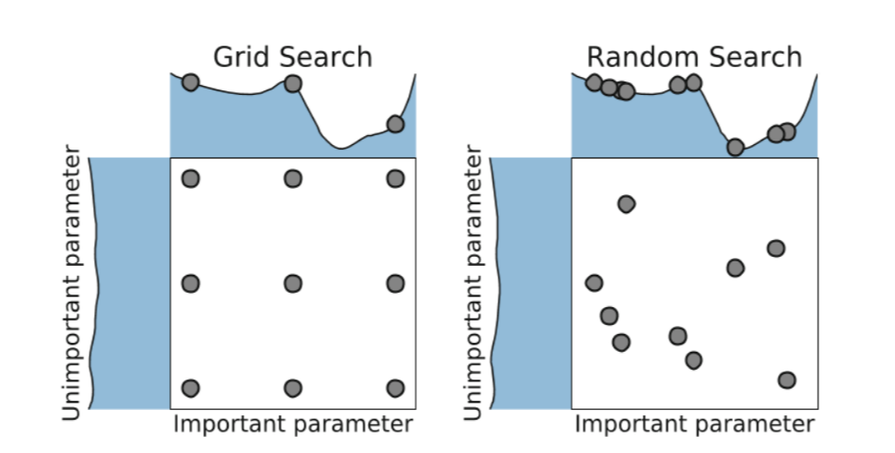

<style type="text/css">
.remark-slide-content {
    font-size: 1.5em;
}
</style>

```{r setup, include=FALSE}
options(htmltools.dir.version = FALSE, cache=TRUE)
```

---

# Plan de la présentation

1. Introduction
2. Un peu de terminologie et notions de base
3. Méthodes de type boîte noire pour l'optimization d'hyperparamètres
  - Recherche par grille
  - Recherche aléatoire
  - Optimization séquentielle / optimization bayésienne
4. Discussion + autres types de méthodes

--

**Objectif**:

Donner une compréhension conceptuelle des méthodes et montrer comment ça marche en pratique.


---
class: center, middle

## Introduction

---
class: center, middle

# Introduction


---
class: center, middle


# Introduction


---
class: center, middle


# Introduction

Différents types de méthodes:

| Black-box methods | Integrated methods |
| :----- | :-----  |
| Grid Search | Hyperband|
|Randomized Search | Bayesian Model Selection |
| Sequential Model-Based Optimization | |

---
class: center, middle

## Terminologie, notations et exemple

---

# Terminologie et notations

- Modèle
- Paramètres
- Performance $R$ de généralisation du modèle
  - Estimé par $\hat R$ sur des données de validation ou par validation croisée.
  
**Hyperparamètres**

Tout ce qui est fixé à l'avance et pas incorporé à l'algorithme d'apprentissage de base:

- type de modèle à utiliser
- quelles features utiliser
- `learning_rate`, `min_samples_leaf`, etc.

---

# Exemple

## Données

```{python}
import pandas as pd
import numpy as np
from sklearn.datasets import fetch_california_housing

dataset = fetch_california_housing(as_frame=True)

X = dataset.data # Covariates
n_features = X.shape[1] # Number of features
y = dataset.target # Median house prices

X.head()
```

---

# Exemple

## Modèle et hyperparamètres

```{python}
from sklearn.ensemble import GradientBoostingRegressor
from skopt.space import Real, Integer

model = GradientBoostingRegressor(n_estimators=25, random_state=0)

space  = [Integer(1, 8, name='max_depth'),
          Real(0.01, 1, "log-uniform", name='learning_rate'),
          Integer(1, n_features, name='max_features'),
          Integer(1, 50, name='min_samples_leaf')
]
```


---

# Exemple

## Évaluation de la performance

```{python}
from sklearn.model_selection import cross_val_score

def Rhat(**params):
  model.set_params(**params)
  
  return -np.mean(cross_val_score(model, X, y, cv=3, n_jobs=-1,
                                  scoring="neg_mean_absolute_error"))
```

```{python}
model.fit(X, y)

Rhat()
```

---
class: center, middle

## Optimization des hyperparamètres

---

# Optimization des hyperparamètres

## Méthodes black-box

- On fait abstraction du fonctionnement interne des modèles.

## Particularités du problème

1. $\hat R$ est coûteuse à évaluer
2. Pas d'information de gradient à propos de $\hat R$
3. Complexité de l'espace d'hyperparamètres
4. Dimensionalité de l'espace d'hyperparamètres


---
class: center, middle

## Recherche par grille

---

# Recherche par grille

## Avantages

- Contrôle sur les paramètres évalués
- Simple et facile à paralléliser

## Désavantages

- Complexité computationelle exponentielle dans le nombre d'hyperparamètres considérés. 
- Sous-optimal pour beaucoup de problèmes.

---

# Recherche par grille

```{python}
from sklearn.model_selection import GridSearchCV

# Budget of 54 evaluations
grid = {
  'max_depth': [1, 3, 5],
  'learning_rate': [0.01, 0.1, 1],
  'max_features': [2, 4, 8],
  'min_samples_leaf': [1, 10]
}

def scoring(estimator, X_test, y_test):
  y_pred = estimator.predict(X_test)
  return -np.mean(np.abs(y_test - y_pred))

results = GridSearchCV(model, grid, cv=3, n_jobs=-1, scoring=scoring).fit(X, y)

-results.best_score_ # Lowest cross-validated mean absolute error
```

---

# Recherche par grille

```{python, echo=FALSE}
import matplotlib.pyplot as plt

plt.clf()
p = plt.figure(figsize=(8, 6))
p = plt.hist(-results.cv_results_["mean_test_score"], bins=20)
p = plt.title("Score distribution for evaluated hyperparameters", loc="left")
p = plt.xlabel("Cross-validated average absolute error")
plt.show()
```

---
class: center, middle

## Recherche aléatoire

---

# Recherche aléatoire



---

# Recherche aléatoire

```{python}
from sklearn.model_selection import RandomizedSearchCV
from scipy.stats import loguniform

# Around roughly the same values as for the grid search
param_distribution = {
  'max_depth': range(1, 8),
  'learning_rate': loguniform(0.01, 1),
  'max_features': range(1, 9),
  'min_samples_leaf': range(1, 50)
}

# Budget of 54 evaluations
results = RandomizedSearchCV(model, param_distribution, n_iter=54, cv=3, n_jobs=-1, scoring=scoring, random_state=0).fit(X, y)

-results.best_score_ # Lowest cross-validated mean absolute error
```

---

# Recherche aléatoire

```{python, echo=FALSE}
import matplotlib.pyplot as plt

plt.clf()
p = plt.figure(figsize=(8, 6))
p = plt.hist(-results.cv_results_["mean_test_score"], bins=20)
p = plt.title("Score distribution for evaluated hyperparameters", loc="left")
p = plt.xlabel("Cross-validated average absolute error")
plt.show()
```

---
class: center, middle

## Sequential Model-Based Optimization

---

# Sequential Model-Based Optimization

## Problème:

- Les méthodes précédentes n'utilisent pas d'information a priori sur $\hat R$.

--

## Hypothèse de régularité:

- Des hyperparamètres similaires ont des performances similaires.

--

Cette hypothèse permet de faire de l'inférence:

Si on a observé $\hat R$ à des points $\lambda_1, \lambda_2, \dots, \lambda_n$, alors on estimer $\hat R$. On peut ensuite choisir un nouveau point $\lambda_{n+1}$ qui a des chances de maximiser $\hat R$.

--

C'est tout l'idée du sequential model-based optimization.


---

# Sequential Model-Based Optimization

Pour le SMBO, on a besoin de:

1. Un modèle inférentiel pour $\hat R$ (e.g. modèle bayésien nonparametrique ou autre).
2. Une méthode pour choisir le prochain hyperparamètre à évaluer, étant donné notre modèle pour $\hat R$ ajusté à l'observation de $\hat R(\lambda_1), \hat R(\lambda_2), \dots, \hat R(\lambda_n)$.

--

Typiquement, on utilise le critère du **expected improvement** pour choisir $\lambda_{n+1}$: on veut maximiser l'espérance de $\max\{R^* - \hat R(\lambda), 0\}$, avec $R^*$ le maximum observé de $\hat R$.

--

Autrement dit, on veut maximiser le potentiel d'améliorer le modèle, sans pénaliser pour la possibilité d'observer une performance plus faible.

---

# Bayesian optimization

```{python}
from skopt import gp_minimize
from skopt.utils import use_named_args

@use_named_args(space)
def objective(**params):
  model.set_params(**params)
  
  return -np.mean(cross_val_score(model, X, y, cv=3, n_jobs=-1,
                                  scoring="neg_mean_absolute_error"))

res_gp = gp_minimize(objective, space, n_calls=54, random_state=1)
```

---

# Bayesian optimization

```{python, echo=FALSE}
plt.clf()
p = plt.figure(figsize=(8,6))
p = plt.hist(res_gp.func_vals, bins=20)
p = plt.title("Score distribution for evaluated hyperparameters", loc="left")
p = plt.xlabel("Cross-validated average absolute error")
plt.show()
```

---

# Bayesian optimization

```{python, echo=FALSE}
from skopt.plots import plot_convergence

p = plt.figure(figsize=(8,6))
plot_convergence(res_gp)
```

---
class: center, middle

## Conclusion


---

# Conclusion

## Résumé

- recherche par grille
- recherche aléatoire
- recherche bayésienne

## Autres méthodes

- Hyperband
- Approches bayésiennes
- marginalisation
- ensembles


